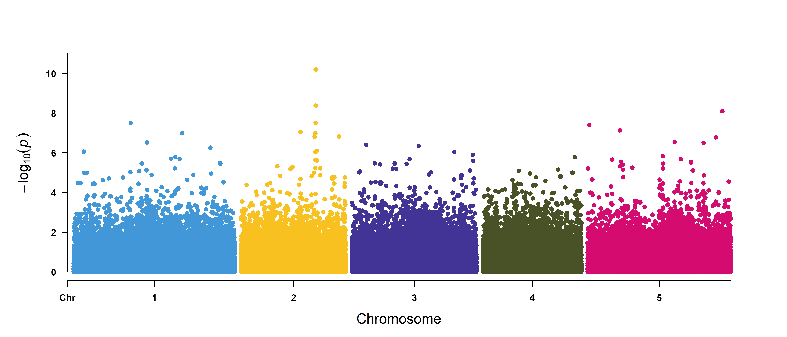
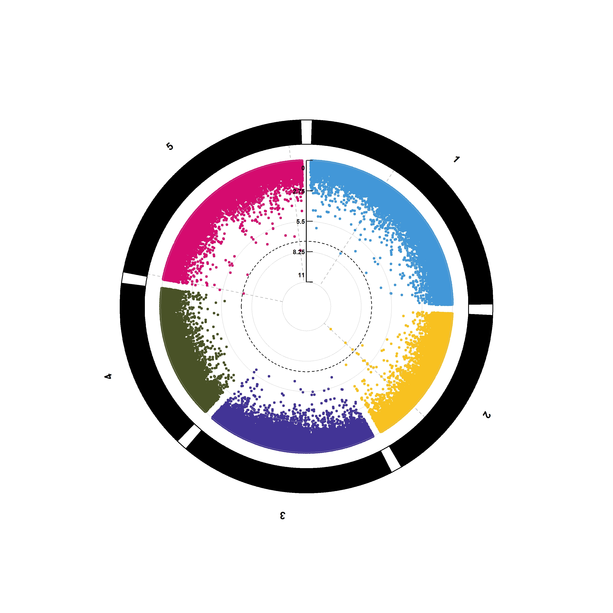
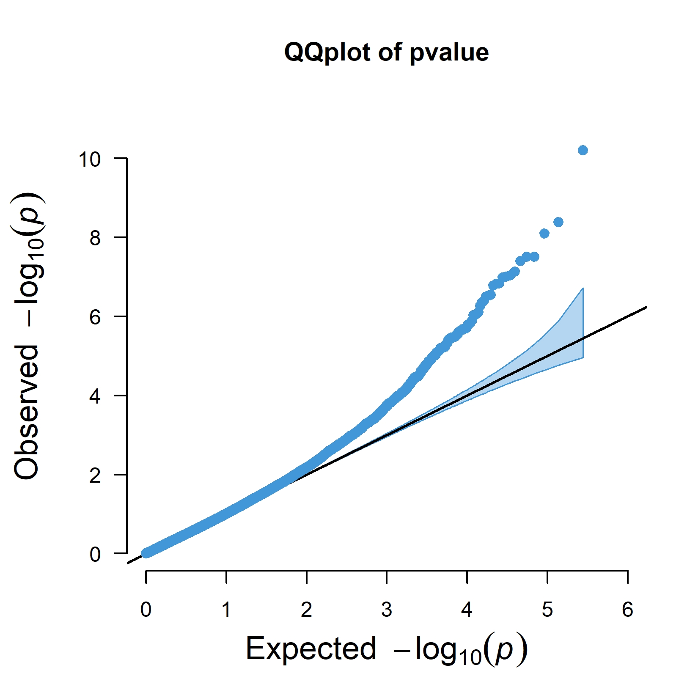
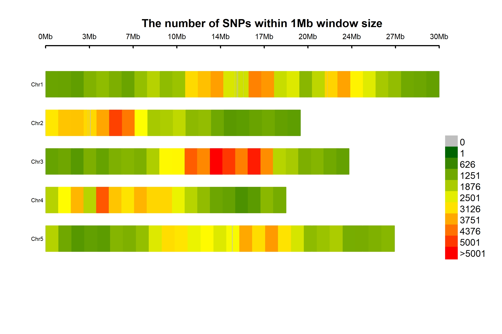

# GWAS
# 目录
* [1. 背景](#1-背景)
    * [1.1 GWAS简介](#11-gwas-简介)
    * [1.2 Bonferroni 校正](#12-bonferroni-校正)
    * [1.3 FDR 校正](#13-fdr-校正)
    * [1.4 GWAS曼哈顿图分析](#14-gwas曼哈顿图分析)
* [2. 流程](#2-流程)
    * [2.1 数据下载](#21-数据下载)
    * [2.2 GWAS 常用文件格式简介](#22-gwas-常用文件格式)
    * [2.3 数据准备和预处理](#23-数据准备和预处理)
    * [2.4 亲缘关系分析](#24-亲缘关系分析)
    * [2.5 关联性分析](#25-关联性分析)
    * [2.6 可视化](#26-可视化)
* [3. 参考](#3-参考)

## 1 背景
### 1.1 GWAS 简介
GWAS全称 Genome-wide association study 全基因组关联分析，即研究表型（关注的性状）和基因型（变异）之间的**关联**，试图找到影响表型的差异的遗传因素

+ 思路

对多个个体全基因组范围的遗传变异性进行检测，获得基因型，进而将基因型与可观测的性状（表型）进行群体水平的统计学分析，根据检验标准筛选出最有可能影响该形状的遗传变异

### 1.2 Bonferroni 校正
我们在进行假设检验的时候，通常会设置一个零假设，之后计算出一个 p 值，即数据分布符合原假设的概率，p 值越低，即代表拒绝原假设的概率越大。我们通常认为 p ＜ 0.05 是一个判断是否显著的阈值。

**但是**，由于GWAS是对基因组上的多个遗传因素进行检验，在同时对多组数据进行处理和比较的时候，很可能其中部分数据因为随机效应而超过阈值，造成假阳性结果。而检验的次数越多，出现假阳性的概率就越大，因此急需一种方法来对结果的阈值进行校正。

+ 原理

Bonferroni校正即为最严格的多重检验矫正方法。在同一数据集上同时检验n个相互独立的假设，那么用于每一假设的统计显著水平，应为仅检验一个假设时的显著水平的1/n。如以显著水平0.05检验同一数据集上两个独立的假设，此时用于检验该两个假设应使用更严格的0.025；对于10000个SNP的检验，若将p设置为1e-6，进行10000次比较之后犯错误的概率是10-6*10000 = 0.01，严格地控制了假阳性的出现。

由于GWAS标记之间的连锁不平衡，可能会存在多个标记或者SNP之间相互连锁的情况，也就是说它们之间的分布并不是完全独立的，所以假设GWAS数据集的每个关联测试都是独立的是不正确的。因此，应用Bonferroni校正通常会为我们提供最保守的p值阈值，其中可能会出现假阴性的情况，我们往往需要根据实际曼哈顿图的情况对阈值进行一些调整。

### 1.3 FDR 校正
FDR（False discovery rate）,表示假阳性率

+ BH（Benjaminiand Hochberg）法计算原理

将每个点的 P 值按照从大到小排序，然后利用公式：P*(n/i) 来计算所对应的 FDR 值；其中 P 是这一次检验的pvalue，n 是检验的次数，i 是排序后的位置 ID（最大的 P 对应的 i 是 n，最小的是 1）；
如果某一个p值所对应的FDR值大于前一位p值（排序的前一位）所对应的FDR值，则放弃公式计算出来的FDR值，选用与它前一位相同的值。因此会产生连续相同FDR值的现象；反之则保留计算的FDR值。

### 1.4 GWAS曼哈顿图分析


图片来源于文章《1,135 Genomes Reveal the Global Pattern of Polymorphism in *Arabidopsis thaliana*》，分析了SNP 与不同温度下拟南芥（10 与 16℃）开花时间之间的关联，黑色和灰色的点表示 1001 数据库中 SNP 的数据，彩色的点表示 RegMap 数据库中的数据；虚线表示 Bonferroni 校正后的 p 值，点线表示 permutation 校正（相比于 Bonferroni 校正松）后的 p 值。

观察左上角的图中的黑色与灰色的点（1001 数据库中拟南芥 SNP 与拟南芥 10℃ 开花时间的关联），我们可以发现在 1 号染色体上于拟南芥 10℃ 开花时间相关显著的 SNP 存在于 *FT*基因上；2 号染色体上可能相关的 SNP 存在于*SVP*基因上；同理 5 号染色体上*DOG1*和*VIN3*上的 SNP 与开花时间存在显著关联。


## 2 流程
+ 与 10 ℃ 下拟南芥开花时间相关的 SNP
### 2.1 数据下载
+ 使用文章[《A new regulator of seed size control in *Arabidopsis* identified by a genome-wide association study》](https://nph.onlinelibrary.wiley.com/doi/10.1111/nph.15642)中的数据 

```bash
mkdir -p data/pheno plink biosoft

cd data
# 基因型文件
wget http://1001genomes.org/data/GMI-MPI/releases/v3.1/1001genomes_snp-short-indel_only_ACGTN.vcf.gz

cd biosoft
# gemma
wget https://github.com/genetics-statistics/GEMMA/releases/download/v0.98.5/gemma-0.98.5-linux-static-AMD64.gz
gunzip gemma-0.98.1-linux-static.gz
chmod +x gemma-0.98.5-linux-static-AMD64
mv gemma-0.98.5-linux-static-AMD64 gemma
./gemma

# Beagle
wget https://faculty.washington.edu/browning/beagle/beagle.22Jul22.46e.jar
```

### 2.2 GWAS 常用文件格式


常用 Plink 进行基因型与表型的关联分析，Plink 常用的文件格式有两套：map/ped 和 bim/fam/bed，两组文件均没有列名，且每一列表示的意思是一定的。

>.map文件主要是图谱文件信息，包括染色体编号、SNP名称、染色体的摩尔位置（可选项，可以用0）、SNP的物理位置
>
>.ped文件主要包括SNP的信息，包括 Family ID(没有可以用个体 ID 代替)、个体 ID、父本编号、母本编号、性别（未知用0）和表型数据(0 或者 -9 = unknown；1 = unaffected; 2 = affected)
>
>.bim文件储存每个遗传变异的相关信息，每行代表一个遗传变异，共六列（染色体位置、遗传变异的编号、遗传变异在基因组上的摩尔位置、碱基对的坐标、等位基因1、等位基因2）
>
>.fam文件储存样本家系信息，共六列（家系编号、个体编号、父系编号（0表示缺失）、母系编号、性别编号、表型值（-9表示缺失））
>
>.bed文件储存基因型信息


### 2.3 数据准备和预处理
+ 查看信息
```bash
# 样本信息
cut -f 2 data/pheno/seed_size.tsv | 
    sed '1d' | 
    grep -v "-" > data/pheno/sample.lst

# 提取样本 SNP 位点
brew install bcftools

tabix -fp vcf data/1001genomes_snp-short-indel_only_ACGTN.vcf.gz
bcftools view -v snps data/1001genomes_snp-short-indel_only_ACGTN.vcf.gz > data/snp.vcf 
bcftools view -h snp.gvcf 
# 最后一行为表头
# CHROM 为染色体的位置、POS 为变异在染色体上的位置、REF 为参考的等位基因、ALT 为突变后的等位基因（多个用逗号分隔）、ID 为遗传变异的 ID（没有就用 .）、QUAL 为变异的质量，代表位点纯合的概率，此值越大则概率越低、FILTER 为次位点是否要被过滤掉、INFO 是变异的相关信息，在表头中有介绍、FORMAT 为表格中变异的格式，同样在表头中有注释，后面的每一列为样本信息

# 筛选出双等位基因位点（biallelic position）以及有表型的菌株
bcftools view -m2 -M2 -S data/pheno/sample.lst data/snp.vcf > data/tem&&
    mv data/tem data/snp.vcf
```
上述过程差不多 3-4 小时

+ 基因型填补

基于观察对象已有的基因型，对缺失的基因型进行填补。基于SNO之间连锁不平衡的原理（某个物种的基因序列可以认为是由很多的单倍体型构成），在进行基因型填补时，首先利用高密度的参照数据获得单倍体型信息，再根据样本观察到的基因型推测该样本最有可能携带的单倍体型。
```bash
# 查看基因型频率
vcftools --vcf data/snp.vcf --freq --out data/freq

head freq.frq
#CHROM   POS     N_ALLELES       N_CHR   {ALLELE:FREQ}
#1       55      2       158     C:1     T:0
#1       56      2       166     T:1     A:0
#1       63      2       138     T:0.971014      C:0.0289855
#1       73      2       146     C:0.945205      A:0.0547945
#1       75      2       144     T:1     A:0
#1       80      2       144     G:0.986111      T:0.0138889
#1       88      2       144     A:0.972222      T:0.0277778
#1       92      2       156     A:0.576923      C:0.423077
#1       94      2       164     C:0.987805      T:0.0121951

java -Xms8G -Xmx8G -jar \
biosoft/beagle.22Jul22.46e.jar nthreads=2 \
gt=data/snp.vcf out=data/snp_imputation ne=172
# 其初始空间(即-Xms),最大空间(-Xmx)
```
填补过程约4小时

+ 使用 Plink 继续进行质控制和后续的分析
```bash
brew install plink2
plink2 --vcf data/snp_imputation.vcf.gz --recode --out plink/SELECT --double-id --threads 4
#10707430 variants and 172 people pass filters and QC.
```

+ 对 SNP 命名，方便后续查找显著的点
```bash
# 修改 SELECT.map 文件的第二列
cat plink/SELECT.map | perl -a -F"\t" -ne'
    $n = $n + 1;
    print "@F[0]\tSNP$n\t@F[2]\t@F[3]";
' > tem&&
    mv tem plink/SELECT.map
```

+ 对 MAF 进行筛选
```bash
# MAF
mkdir -p plink/SNP_qc
plink2 --file plink/SELECT --maf 0.05 --make-bed --out plink/SNP_qc/SNP_qc
#1782903 variants and 172 people pass filters and QC.
```

+ 基于连锁不平衡进行过滤
```bash
mkdir -p plink/LD_filter
plink2 --bfile plink/SNP_qc/SNP_qc --indep 50 5 2 --out plink/LD_filter/LD_filter
# Marker lists written to plink/LD_filter/LD_filter.prune.in and plink/LD_filter/LD_filter.prune.out .

wc -l plink/LD_filter/LD_filter.prune.in
# 275087
plink2 --bfile plink/SNP_qc/SNP_qc --extract plink/LD_filter/LD_filter.prune.in --make-bed --out plink/SNP_LD 
```

> 1. 为什么对MAF进行过滤
>
> MAF:minor allele frequency,次等位基因频率；某个一个位点有AA或AT或TT，那么就可以计算A的基因频率和T的基因频率，qA + qT = 1，这里谁比较小，谁就是最小等位基因频率，qA = 0.3，qT = 0.7，那么这个位点的 MAF 为 0.3（如果一个位点有三个等位基因，那么频率排在中间的、第二大是 MAF；如果一个位点有四个等位基因，那么频率为第二大的为 MAF）。之所以用这个过滤标准，是因为 MAF 如果非常小，那么意味着大部分位点都是相同的基因型，这些位点贡献的信息非常少，放在计算中增加计算量，增加了假阳性的可能。
>
>2. 为什么只考虑双等位基因？
>
> 减少计算量？LD衰减计算？
>
>3. 哈温（Haed-Weinberg）平衡检验
>
> 在理想状态（种群足够大、种群个体间随机交配、没有突变、没有选择、没有迁移、没有遗传漂变）下，各等位基因的频率在遗传中是稳定不变的。为什么要去除不符合的位点？这边是否需要进行检验？


### 2.4 亲缘关系分析
```bash
#fam文件第6列为-9，使用GEMMA前需要将第6列替换为对应要分析的表型
sed -i 's/\s/\t/g' plink/SNP_LD.fam
tsv-select --fields 1,2,3,4,5 plink/SNP_LD.fam > tem&&
    mv tem plink/SNP_LD.fam

tsv-select -H --fields easyGWAS_ID,Seed_size data/pheno/seed_size.tsv | sed '1d' | grep -v "-" > merge.tsv
tsv-join --filter-file merge.tsv --key-fields 1 --append-fields 2 plink/SNP_LD.fam > tem&&
    mv tem plink/SNP_LD.fam
rm merge.tsv

# 亲缘关系分析
biosoft/gemma -bfile plink/SNP_LD -gk -o kinship
```

## 2.5 关联性分析
```bash
# 关联分析
mkdir association
biosoft/gemma -bfile plink/SNP_LD -lmm -k output/kinship.cXX.txt -o association
```

## 2.6 可视化
```bash
head -n 3 output/association.assoc.txt
#chr     rs      ps      n_miss  allele1 allele0 af      beta    se      logl_H1 l_remle p_wald
#1       SNP4    73      0       A       C       0.105   -5.241239e-03   3.053898e-03    3.925844e+02    5.323277e+00    8.793863e-02
#1       SNP8    92      0       A       C       0.401   -5.080006e-05   1.985871e-03    3.911600e+02    5.845888e+00    9.796218e-01
```

```R
DATA <- read.table("./output/association.assoc.txt", header = T, sep = "\t")
df <- data.frame(rs=DATA$rs, chr=DATA$chr, pos=DATA$ps, pvalue=DATA$p_wald)
install.packages("rMVP")
library(rMVP)
MVP.Report(df, threshold =5e-8, threshold.col="black")
```

+ 曼哈顿图


+ 环形曼哈顿图


+ QQ图


+ SNP密度图


## 3 参考
[1. GWAS 分析](https://zhuanlan.zhihu.com/p/158869408)

[2. GWAS分析基本流程及分析思路](https://www.jianshu.com/p/f27c620d0bb2)

[3. 什么是Bonferroni校正？| 群体遗传专题](https://zhuanlan.zhihu.com/p/440376273)

[4. plink格式文件的介绍及相互转换](https://blog.csdn.net/qq_22253901/article/details/121608557)

[5. VCF文件解读](https://www.jianshu.com/p/a108790ad2a6?u_atoken=b042a893-03bd-4a38-8031-52f0d3f65353&u_asession=01lCes1MtWioqAIP_RItPwcuzj6hQ37QKxHHGlYxXawwEBiPTC8Ag56DVIqub2V-f9X0KNBwm7Lovlpxjd_P_q4JsKWYrT3W_NKPr8w6oU7K_pY8fQ6FgtGe1q2uu-pEeJh4gB_rorF7cG9vr14abfLGBkFo3NEHBv0PZUm6pbxQU&u_asig=05ESJ0rAXmqHXPIepLzgwTZsuqSHavU9_kPUis9ZnDVBSXtNlBC9h0t4_dTYWj-zy5NnvV3cVdjT2zrkAtku5L4yJxs3aynCvlGiT_Ub66P0OM-iPBV-Ab_KzVnc8ABe8ZceNDbk5keBc6Xq837uhdStGvS2XQ8opQZn8Aipfp0uL9JS7q8ZD7Xtz2Ly-b0kmuyAKRFSVJkkdwVUnyHAIJzRADLOfJygZ2zefxmuwu51PbAMUp1ftJmFa5oLwIVmFkU-X92pnuaZyu-ch7KXFYKu3h9VXwMyh6PgyDIVSG1W9VWGQ0BJ8FO2D990EYuxyemfC2no16gp6PDScqDB1dOPIj5IcN8seykp_tZiDxsyT7xYdsOTzck1OTWHNmt6LNmWspDxyAEEo4kbsryBKb9Q&u_aref=68wg77kctEKwOJA%2F8Eal%2FkCiJXw%3D)

[6. VCF转换PLINK格式的3种方法](https://blog.51cto.com/u_10721944/5398621)

[7. 全基因组关联分析学习资料](https://www.jianshu.com/p/cf1a3fabd96a)

[8. 笔记 | GWAS 操作流程3：Plink 关联分析](http://www.360doc.com/content/21/1118/13/77772224_1004706906.shtml)

[9. 文献笔记五十四：全基因组关联分析鉴定拟南芥中控制种子大小的调节因子](https://cloud.tencent.com/developer/article/1593313)
