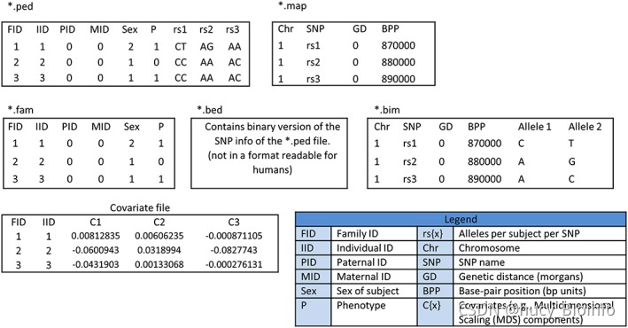

# GWAS
# 目录
* [1. 背景](#1-背景)
    * [1.1 GWAS简介](#11-gwas-简介)
    * [1.2 Bonferroni 校正](#12-bonferroni-校正)
    * [1.3 FDR 校正](#13-fdr-校正)
    * [1.4 GWAS曼哈顿图分析](#14-gwas曼哈顿图分析)
* [2. 流程](#2-流程)
    * [2.1 数据下载](#21-数据下载)
    * [2.2 GWAS 常用文件格式简介](#22-gwas-常用文件格式)
    * [2.3 数据准备和预处理](#23-数据准备和预处理)
    * [2.4 群体分层矫正 optional](#24-群体分层校正)
    * [2.5 关联性分析](#25-关联性分析)
    * [2.6 可视化](#26-可视化)
* [3. 参考](#3-参考)

## 1 背景
### 1.1 GWAS 简介
GWAS全称 Genome-wide association study 全基因组关联分析，即研究表型（关注的性状）和基因型（变异）之间的**关联**，试图找到影响表型的差异的遗传因素

+ 思路

对多个个体全基因组范围的遗传变异性进行检测，获得基因型，进而将基因型与可观测的性状（表型）进行群体水平的统计学分析，根据检验标准筛选出最有可能影响该形状的遗传变异

### 1.2 Bonferroni 校正
我们在进行假设检验的时候，通常会设置一个零假设，之后计算出一个 p 值，即数据分布符合原假设的概率，p 值越低，即代表拒绝原假设的概率越大。我们通常认为 p ＜ 0.05 是一个判断是否显著的阈值。

**但是**，由于GWAS是对基因组上的多个遗传因素进行检验，在同时对多组数据进行处理和比较的时候，很可能其中部分数据因为随机效应而超过阈值，造成假阳性结果。而检验的次数越多，出现假阳性的概率就越大，因此急需一种方法来对结果的阈值进行校正。

+ 原理

Bonferroni校正即为最严格的多重检验矫正方法。在同一数据集上同时检验n个相互独立的假设，那么用于每一假设的统计显著水平，应为仅检验一个假设时的显著水平的1/n。如以显著水平0.05检验同一数据集上两个独立的假设，此时用于检验该两个假设应使用更严格的0.025；对于10000个SNP的检验，若将p设置为1e-6，进行10000次比较之后犯错误的概率是10-6*10000 = 0.01，严格地控制了假阳性的出现。

由于GWAS标记之间的连锁不平衡，可能会存在多个标记或者SNP之间相互连锁的情况，也就是说它们之间的分布并不是完全独立的，所以假设GWAS数据集的每个关联测试都是独立的是不正确的。因此，应用Bonferroni校正通常会为我们提供最保守的p值阈值，其中可能会出现假阴性的情况，我们往往需要根据实际曼哈顿图的情况对阈值进行一些调整。

### 1.3 FDR 校正
FDR（False discovery rate）,表示假阳性率

+ BH（Benjaminiand Hochberg）法计算原理

将每个点的 P 值按照从大到小排序，然后利用公式：P*(n/i) 来计算所对应的 FDR 值；其中 P 是这一次检验的pvalue，n 是检验的次数，i 是排序后的位置 ID（最大的 P 对应的 i 是 n，最小的是 1）；
如果某一个p值所对应的FDR值大于前一位p值（排序的前一位）所对应的FDR值，则放弃公式计算出来的FDR值，选用与它前一位相同的值。因此会产生连续相同FDR值的现象；反之则保留计算的FDR值。

### 1.4 GWAS曼哈顿图分析


图片来源于文章《1,135 Genomes Reveal the Global Pattern of Polymorphism in *Arabidopsis thaliana*》，分析了SNP 与不同温度下拟南芥（10 与 16℃）开花时间之间的关联，黑色和灰色的点表示 1001 数据库中 SNP 的数据，彩色的点表示 RegMap 数据库中的数据；虚线表示 Bonferroni 校正后的 p 值，点线表示 permutation 校正（相比于 Bonferroni 校正松）后的 p 值。

观察左上角的图中的黑色与灰色的点（1001 数据库中拟南芥 SNP 与拟南芥 10℃ 开花时间的关联），我们可以发现在 1 号染色体上于拟南芥 10℃ 开花时间相关显著的 SNP 存在于 *FT*基因上；2 号染色体上可能相关的 SNP 存在于*SVP*基因上；同理 5 号染色体上*DOG1*和*VIN3*上的 SNP 与开花时间存在显著关联。


## 2 流程
+ 与 10 ℃ 下拟南芥开花时间相关的 SNP
### 2.1 数据下载
+ 使用文章[《1,135 Genomes Reveal the Global Pattern of Polymorphism in *Arabidopsis thaliana*》](https://doi.org/10.1038/s41586-018-0030-5)中的数据 

```bash
mkdir data plink PCA association

cd data
# 基因型文件(17G)
wget http://1001genomes.org/data/GMI-MPI/releases/v3.1/1001genomes_snpeff_v3.1/1001genomes_snp-short-indel_only_ACGTN_v3.1.vcf.snpeff.gz


# 表型文件
mkdir pheno
http://1001genomes.org/tables/1001genomes-FT10-FT16_and_1001genomes-accessions.html
# 将文件以 tsv 格式导出，将换行符 CRLF 改为 LF
```

### 2.2 GWAS 常用文件格式


常用 Plink 进行基因型与表型的关联分析，Plink 常用的文件格式有两套：map/ped 和 bim/fam/bed，两组文件均没有列名，且每一列表示的意思是一定的。

>.map文件主要是图谱文件信息，包括染色体编号、SNP名称、染色体的摩尔位置（可选项，可以用0）、SNP的物理位置
>
>.ped文件主要包括SNP的信息，包括 Family ID(没有可以用个体 ID 代替)、个体 ID、父本编号、母本编号、性别（未知用0）和表型数据(0 或者 -9 = unknown；1 = unaffected; 2 = affected)
>
>.bim文件储存每个遗传变异的相关信息，每行代表一个遗传变异，共六列（染色体位置、遗传变异的编号、遗传变异在基因组上的摩尔位置、碱基对的坐标、等位基因1、等位基因2）
>
>.fam文件储存样本家系信息，共六列（家系编号、个体编号、父系编号（0表示缺失）、母系编号、性别编号、表型值（-9表示缺失））
>
>.bed文件储存基因型信息


### 2.3 数据准备和预处理
+ 查看菌株信息
```bash
cd data
bcftools view -h 1001genomes_snp-short-indel_only_ACGTN_v3.1.vcf.snpeff.gz | 
    grep -v "##" | datamash transpose | wc -l
# 1144(1135 株植株)

# 只关注在 10 ℃ 下的开花时间
cd pheno
tsv-select -H --fields id,FT10_mean '1001genomes-FT10-FT16_and_1001genomes- accessions - FT10_FT16_accessions.tsv' > FT10.tsv

tsv-filter -H --str-ne 2:NA FT10.tsv > tem&&
    mv tem FT10.tsv

sed '1d' FT10.tsv | cut -f 1 > ../filter.lst
cat ../filter.lst | wc -l
# 1003 株植株有表型信息
```

+ 数据质量控制

质控一般包含两个方向：[一个是样本的质量控制（缺失率 < 5%;杂合性等）；另一个是 SNP 位点的质量控制（MAF > 5%; 哈温平衡检验等）](https://zhuanlan.zhihu.com/p/149947873?from_voters_page=true)

```bash
cd data
# 筛选出其中的 SNP 位点
brew install bcftools

tabix -fp vcf 1001genomes_snp-short-indel_only_ACGTN_v3.1.vcf.snpeff.gz
bcftools view -v snps 1001genomes_snp-short-indel_only_ACGTN_v3.1.vcf.snpeff.gz > snp.vcf 
bcftools view -h snp.gvcf 
# 最后一行为表头
# CHROM 为染色体的位置、POS 为变异在染色体上的位置、REF 为参考的等位基因、ALT 为突变后的等位基因（多个用逗号分隔）、ID 为遗传变异的 ID（没有就用 .）、QUAL 为变异的质量，代表位点纯合的概率，此值越大则概率越低、FILTER 为次位点是否要被过滤掉、INFO 是变异的相关信息，在表头中有介绍、FORMAT 为表格中变异的格式，同样在表头中有注释，后面的每一列为样本信息

# 观察一下vcf文件的格式
head -n 18 snp.vcf | grep -v "#" | cut -f 1,2,3,4,5,6,7,8,9,10,11
# 1       55      .       C       T       40      PASS    DP=6720 GT:GQ:DP        ./.:.:. 0|0:36:4
# 1       56      .       T       A       40      PASS    DP=6785 GT:GQ:DP        ./.:.:. ./.:.:.

# 筛选出双等位基因位点（biallelic position）以及有表型的菌株
bcftools view -m2 -M2 -S filter.lst snp.vcf > tem&&
    mv tem snp.vcf
```

+ 使用 Plink 继续进行质控制和后续的分析
```bash
brew install plink2

cd plink
plink2 --vcf ../data/snp.vcf --recode --out SELECT --double-id --threads 2
# 10707430 variants and 1003 people pass filters and QC

# 查看数据缺失情况
mkdir pre_view
plink2 --file SELECT --missing --out ./pre_view/pre_view --threads 2
# Sample missing data report written to ./pre_view/pre_view.imiss
# variant-based missing data report written to ./pre_view/pre_view.lmiss
```
>**个体缺失位点统计预览**
>
>第一列为家系ID，第二列为个体ID，第三列是否表型缺失，第四列缺失的SNP个数，第五列总SNP个数，第六列缺失率
>
>**SNP缺失的个体数文件预览**
>
>第一列为染色体，第二列为SNP名称，第三列为缺失个数，第四列为总个数，第五列为缺失率

+ 可视化
```bash
# Sample
sed -i 's/^\s\+//g' pre_view/pre_view.imiss
sed -i 's/\s\+/\t/g' pre_view/pre_view.imiss
plotr hist pre_view/pre_view.imiss -c 6 --xl "SAMPLE_MISSING" --device png -o pre_view/sample.png

# SNP
sed -i 's/^\s\+//g' pre_view/pre_view.lmiss
sed -i 's/\s\+/\t/g' pre_view/pre_view.lmiss
plotr hist pre_view/pre_view.lmiss -c 5 --xmm 0,0.25 --xl "SNP_MISSING" --device png -o pre_view/SNP.png
```


0.15为分界


0.025为分界

+ 对 SNP 命名，方便后续查找显著的点
```bash
# 修改 SELECT.map 文件的第二列
cat SELECT.map | perl -a -F"\t" -ne'
    $n = $n + 1;
    print "@F[0]\tSNP$n\t@F[2]\t@F[3]";
' > tem&&
    mv tem SELECT.map
```

+ 对样本进行质量控制
```bash
# 样本数据缺失率大于 5% 去除
mkdir sample_qc
plink2 --file SELECT --mind 0.15 --make-bed --out ./sample_qc/sample_qc
# 10707430 variants and 407 people pass filters and QC.
```

+ 对 SNP 位点进行质量控制
```bash
# MAF、缺失率
mkdir SNP_qc
plink2 --bfile ./sample_qc/sample_qc --geno 0.05 --maf 0.03 --make-bed --out ./SNP_qc/SNP_qc 
# 378056 variants and 407 people pass filters and QC.
```

> 1. 为什么对MAF进行过滤
>
> MAF:minor allele frequency,次等位基因频率；某个一个位点有AA或AT或TT，那么就可以计算A的基因频率和T的基因频率，qA + qT = 1，这里谁比较小，谁就是最小等位基因频率，qA = 0.3，qT = 0.7，那么这个位点的 MAF 为 0.3（如果一个位点有三个等位基因，那么频率排在中间的、第二大是 MAF；如果一个位点有四个等位基因，那么频率为第二大的为 MAF）。之所以用这个过滤标准，是因为 MAF 如果非常小，那么意味着大部分位点都是相同的基因型，这些位点贡献的信息非常少，放在计算中增加计算量，增加了假阳性的可能。
>
>2. 为什么只考虑双等位基因？
>
> 减少计算量？LD衰减计算？
>
>3. 哈温（Haed-Weinberg）平衡检验
>
>在理想状态（种群足够大、种群个体间随机交配、没有突变、没有选择、没有迁移、没有遗传漂变）下，各等位基因的频率在遗传中是稳定不变的。为什么要去除不符合的位点？这边是否需要进行检验？


## 2.4 群体分层校正(optional)
+ 原因
GWAS研究时经常碰到群体分层的现象，即该群体的祖先来源多样性，我们知道的，不同群体SNP频率不一样，导致后面做关联分析的时候可能出现假阳性位点（不一定是显著信号位点与该表型有关，可能是与群体 SNP 频率差异有关），因此我们需要在关联分析前对该群体做PCA分析，随后将PCA结果作为协变量加入关联分析中。

```bash
cd PCA
plink2 --bfile ../plink/SNP_qc/SNP_qc --pca 10 --out SNP_qc_pca
# --pca 后面的数字表示选取了几个关注的主成分，具体后续关联分析中要选多少个，还要看哪些主成分有显著的统计学意义
```

+ 利用 twstats 计算显著的主成分
```bash
# 软件下载
wget https://data.broadinstitute.org/alkesgroup/EIGENSOFT/EIG-6.1.4.tar.gz
tar xzvf EIG-6.1.4.tar.gz

cd EIG-6.1.4/bin
export PATH="$(pwd):$PATH"

# 计算显著性
cd PCA
twstats -t twtable -i SNP_qc_pca.eigenval -o eigenvaltw.out
cat eigenvaltw.out | mlr --itsv --omd cat
```
|   #N    eigenvalue  difference    twstat      p-value effect. n |
| --- |
|    1     57.378600          NA    -1.467     0.563224    49.271 |
|    2     55.965700   -1.412900        NA           NA        NA |
|    3     46.365800   -9.599900        NA           NA        NA |
|    4     31.312300  -15.053500        NA           NA        NA |
|    5     25.414400   -5.897900        NA           NA        NA |
|    6     24.690100   -0.724300        NA           NA        NA |
|    7     20.789900   -3.900200        NA           NA        NA |
|    8     17.804700   -2.985200        NA           NA        NA |
|    9     16.664400   -1.140300        NA           NA        NA |
|   10     15.095000   -1.569400        NA           NA        NA |

测试所得到的10各主成分都没有显著性

## 2.5 关联性分析
```bash
# 用法：plink2 --bfile mydata --linear --pheno pheno.txt --mpheno 1 --covar covar.txt --covar-number 1,2,3 --out mydata -noweb --allow-extra-chr

# --linear表示用的连续型线性回归，如果表型是二项式类型，则用--logistic
# --pheno后面加表型文件（第一列和第二列是 Fanily ID 和 Individual ID;第三列以后的每一列都是表型）
# --covar后面加协变量文件（第一列和第二列是 Fanily ID 和 Individual ID;第三列以后的每一列都是协变量，可以是之前计算的 pca 主成分）
# --mpheno 1指的是表型文件的第三列（第一个表型）
# --covar-number 1,2,3 指的是协变量文件的第三列、第四列和第五列（第一个、第二个和第三个协变量）

# 构建表型文件
cd data/pheno

sed '1d' FT10.tsv | perl -a -F"\t" -n -e'
    print "@F[0]\t$_";
' > pheno.txt

# 关联分析
cd association

plink2 -bfile ../plink/SNP_qc/SNP_qc --linear --pheno ../data/pheno/pheno.txt --mpheno 1 --adjust -noweb --allow-no-sex --out mydata

# 结果存放在 mydata.assoc.linear 文件中,mydata.assoc.linear.adjusted 中存放了校正的p值
```
>**.adjusted文件**
>
>GC：Genomic control corrected p-value. Requires an additive model.
>
>BONF：Bonferroni correction adjusted p-value.
>
>HOLM：Holm-Bonferroni adjusted p-value.
>
>SIDAK_SS：Single-step adjusted p-value.
>
>SIDAK_SD：Step-down adjusted p-value.
>
>FDR_BH：Step-up false discovery control

## 2.6 可视化
### 2.6.1 曼哈顿图

```bash
for i in mydata.assoc.linear mydata.assoc.linear.adjusted;do
    sed -i 's/^\s\+//g' $i
    sed -i 's/\s\+/\t/g' $i
done
```

```R
install.packages("qqman")
library(qqman)

FILE <- "mydata.assoc.linear"
gwasRESULT <- read.table(FILE, header = TRUE)
manhattan(gwasRESULT)
# 默认的 suggestiveline（蓝色） 为 -log10(1e-5),而 genome-wide sigificant（红色） 为 -log10(5e-8)

manhattan(gwasRESULT, annotatePval = 0.0000001)
# 显示校正后 P 值小于 0.0000001 的点

manhattan(subset(gwasRESULT,CHR == 13),annotatePval = 0.0000001)
# 只关注 13 号染色体上的突变
```


## 3 参考
[1. GWAS 分析](https://zhuanlan.zhihu.com/p/158869408)

[2. GWAS分析基本流程及分析思路](https://www.jianshu.com/p/f27c620d0bb2)

[3. 什么是Bonferroni校正？| 群体遗传专题](https://zhuanlan.zhihu.com/p/440376273)

[4. plink格式文件的介绍及相互转换](https://blog.csdn.net/qq_22253901/article/details/121608557)

[5. VCF文件解读](https://www.jianshu.com/p/a108790ad2a6?u_atoken=b042a893-03bd-4a38-8031-52f0d3f65353&u_asession=01lCes1MtWioqAIP_RItPwcuzj6hQ37QKxHHGlYxXawwEBiPTC8Ag56DVIqub2V-f9X0KNBwm7Lovlpxjd_P_q4JsKWYrT3W_NKPr8w6oU7K_pY8fQ6FgtGe1q2uu-pEeJh4gB_rorF7cG9vr14abfLGBkFo3NEHBv0PZUm6pbxQU&u_asig=05ESJ0rAXmqHXPIepLzgwTZsuqSHavU9_kPUis9ZnDVBSXtNlBC9h0t4_dTYWj-zy5NnvV3cVdjT2zrkAtku5L4yJxs3aynCvlGiT_Ub66P0OM-iPBV-Ab_KzVnc8ABe8ZceNDbk5keBc6Xq837uhdStGvS2XQ8opQZn8Aipfp0uL9JS7q8ZD7Xtz2Ly-b0kmuyAKRFSVJkkdwVUnyHAIJzRADLOfJygZ2zefxmuwu51PbAMUp1ftJmFa5oLwIVmFkU-X92pnuaZyu-ch7KXFYKu3h9VXwMyh6PgyDIVSG1W9VWGQ0BJ8FO2D990EYuxyemfC2no16gp6PDScqDB1dOPIj5IcN8seykp_tZiDxsyT7xYdsOTzck1OTWHNmt6LNmWspDxyAEEo4kbsryBKb9Q&u_aref=68wg77kctEKwOJA%2F8Eal%2FkCiJXw%3D)

[6. VCF转换PLINK格式的3种方法](https://blog.51cto.com/u_10721944/5398621)

[7. 全基因组关联分析学习资料](https://www.jianshu.com/p/cf1a3fabd96a)

[8. 笔记 | GWAS 操作流程3：Plink 关联分析](http://www.360doc.com/content/21/1118/13/77772224_1004706906.shtml)
