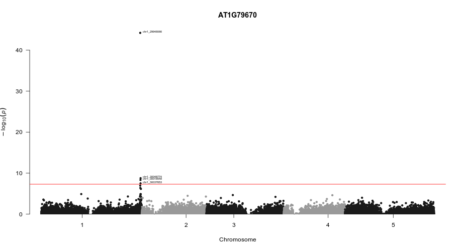

# 使用 R 进行 GWAS 分析
## 1 背景
### 1.1 泊松分布
泊松分布适合于描述单位时间内随机事件发生的次数，如某一服务设施在一定时间内到达的人数，电话交换机接到呼叫的次数，汽车站台的候客人数，机器出现的故障数等。（事件是独立发生的；事件发生的概率在给定的固定时间内不随时间变化）

概率函数：P(X = k) = (λ<sup>k</sup>/k!)e<sup>-λ</sup>

λ 表示一段时间内事件发生的平均次数；k 表示一段时间内事件发生的次数。

### 1.2 二项分布
二项分布即重复n次独立的伯努利试验。在每次试验中只有两种可能的结果，而且两种结果发生与否互相对立，并且相互独立，与其它各次试验结果无关，事件发生与否的概率在每一次独立试验中都保持不变，则这一系列试验总称为n重伯努利实验

+ 负二项分布

在一系列伯努利试验中，失败次数到达指定次数时，成功次数的离散概率分布。
这是泊松分布的过度分散版本。当期望值很高时，负二项分布的标准偏差与期望值成比例增加，对数正态分布也是如此。

### 1.3 伽马分布
是统计学中的连续概率函数，要等到n个随机事件都发生，需要经历多久时间。


### 1.4 glm 函数结果解读
```
Call:  glm(formula = AT1G10920 ~ chr1_10000545, family = Gamma(link = "inverse"), 
    data = DATA, na.action = na.omit)
# 套用的公式

Coefficients:
  (Intercept)  chr1_10000545  
    0.1518219      0.0001042  
# Coefficients：回归系数
# intercept：常数项

Degrees of Freedom: 451 Total (i.e. Null);  450 Residual
  (因为不存在，20个观察量被删除了)
Null Deviance:	    1.116 
Residual Deviance: 1.115 	AIC: 267.3
# Degrees of Freedom：自由度，计算某一统计量时，取值不受限制的变量个数
# Null Deviance：无效偏差，是指仅包括截距项、不包括解释变量的模型和饱和模型比较得到的偏差统计量的值
# Residual Deviance：残差，是指既包括截距项，又包括解释变量的模型和饱和模型比较得到的偏差统计量的值
# AIC值：Akaike information criterion，是衡量统计模型拟合优良性的一种标准，AIC越小，模型越好

summary(glm_result)$coefficients

                  Estimate  Std. Error    t value    Pr(>|t|)
(Intercept)   0.1518218665 0.003813069 39.8161864    1.442509e-149 
chr1_10000545 0.0001042195 0.000224933  0.4633359    6.433476e-01

# ESTIMATE：回归系数估计值
# Std. Error：标准误，样本平均数的标准差
# t value：t 检验
# Pr(>|t|)：t 检验的 p 值
```

+ lm 与 glm 

lm 简单线性回归；glm 广义线性回归，当 glm 中的因变量分布为正态分布时，且只有一个自变量时，两者结果相等


## 2 数据预处理和导入

+ 使用 210217.SuppDataSet2.DiploidUnitNumberCalls.tsv 表型文件 Rexp.tsv

+ test
```bash
# 将缺失值改为 NA
sed -i 's/\t\t/\tNA\t/g' 210217.SuppDataSet2.DiploidUnitNumberCalls.tsv
cat 210217.SuppDataSet2.DiploidUnitNumberCalls.tsv | perl -ne'
    s/\t\n/\tNA\n/g;
    print "$_";
' > tem&&
mv tem 210217.SuppDataSet2.DiploidUnitNumberCalls.tsv

# 修改表头
sed -i 's/^0/SAMPLE/' 210217.SuppDataSet2.DiploidUnitNumberCalls.tsv
sed -i 's/^\t/SAMPLE\t/' Rexp.tsv

tsv-join -H --filter-file Rexp.tsv --key-fields SAMPLE --append-fields AT1G10920 <(tsv-select -H --fields SAMPLE,chr1_10000545 210217.SuppDataSet2.DiploidUnitNumberCalls.tsv) > test.tsv
```
```R
# 用法：lm(Y ~ X1 + X2 + X3, data = data, na.action=na.omit)

FILE <- "test.tsv"
DATA <- read.table(FILE, header = TRUE, sep = "\t")

model <- lm(formula = AT1G10920 ~ chr1_10000545,data = DATA, na.action = na.omit)

write.table(coef(summary(model))[,4],file = "test.tsv", sep = "\t"
```


+ 循环
```bash
head -n 1 Rexp.tsv | datamash transpose | sed '1d' | wc -l
# 86
head -n 1 210217.SuppDataSet2.DiploidUnitNumberCalls.tsv | datamash transpose | sed '1d' | wc -l
# 21012(21011 STR)

RGENE=$(head -n 1 data/Rexp.tsv | datamash transpose | sed '1d')
STR=$(head -n 1 data/210217.SuppDataSet2.DiploidUnitNumberCalls.tsv | datamash transpose | sed '1d')

for i in $RGENE;do
  echo "=====>$i"
  echo -e "STR\t$i" >> $i.tsv
  for j in $STR;do
    tsv-join -H --filter-file Rexp.tsv --key-fields SAMPLE --append-fields $i <(tsv-select -H --fields SAMPLE,$j 210217.SuppDataSet2.DiploidUnitNumberCalls.tsv) > $i.$j.tsv

    Rscript -e '
      FILE <- list.files(path = ".", pattern = "chr")
      DATA <- read.table(FILE, header = TRUE, sep = "\t")
      model <- lm(formula = DATA[,3] ~ DATA[,2],data = DATA, na.action = na.omit)
      write.table(coef(summary(model))[,4],file = "temporary.tsv", sep = "\t")
    '
    sed -i '1,2d' temporary.tsv
    sed -i 's/"//g' temporary.tsv
    sed -i "s/DATA\[, 2\]/$j/" temporary.tsv
    cat temporary.tsv >> $i.tsv
    rm $i.$j.tsv
  done
done
```

+ parallel(lm)
```bash
for i in $RGENE;do
  echo "=====>$i"
  echo -e "STR\t$i" >> $i.tsv
  parallel --linebuffer -k -j 4 "
  
    tsv-join -H --filter-file data/Rexp.tsv --key-fields SAMPLE --append-fields $i <(tsv-select -H --fields SAMPLE,{1} data/210217.SuppDataSet2.DiploidUnitNumberCalls.tsv) > $i.{1}.tsv

    Rscript script/lm.r $i.{1}.tsv
    rm $i.{1}.tsv

    sed -i '1,2d' $i.{1}.tsv.lst
    sed -i 's/DATA\[, 2\]/{1}/' $i.{1}.tsv.lst
  
    cat $i.{1}.tsv.lst >> $i.tsv
    rm $i.{1}.tsv.lst

  " ::: $(head -n 1 data/210217.SuppDataSet2.DiploidUnitNumberCalls.tsv | datamash transpose | sed '1d')
done
```

+ parallel(glm - quasipoisson)
```bash
for i in $RGENE;do
  echo "=====>$i"
  echo -e "STR\t$i" >> $i.tsv
  parallel --linebuffer -k -j 4 "
  
    tsv-join -H --filter-file data/Rexp.tsv --key-fields SAMPLE --append-fields $i <(tsv-select -H --fields SAMPLE,{1} data/210217.SuppDataSet2.DiploidUnitNumberCalls.tsv) > $i.{1}.tsv
    tsv-join -H --filter-file data/group/group.tsv --key-fields SAMPLE --append-fields Admixture_Group $i.{1}.tsv > $i.{1}.tem&&
      mv $i.{1}.tem $i.{1}.tsv

    Rscript script/glm.r $i.{1}.tsv
    rm $i.{1}.tsv

    sed -i 's/DATA\[, 2\]/{1}/' $i.{1}.tsv.lst
    sed -i '/^as/'d $i.{1}.tsv.lst
    sed -i '1,2d' $i.{1}.tsv.lst
  
    cat $i.{1}.tsv.lst >> $i.tsv
    rm $i.{1}.tsv.lst

  " ::: $(head -n 1 data/210217.SuppDataSet2.DiploidUnitNumberCalls.tsv | datamash transpose | sed '1d')
done
```

+ 可视化（lm_result ==> AT1G10920.tsv）
```bash
# 对原文件进行修改
cat AT1G10920.tsv | perl -a -F"\t" -ne'
  if (/^STR/) {
    print "SNP\tCHR\tBP\tP\n";
  }elsif (/^chr(\d)_(\d+)/) {
    print "@F[0]\t$1\t$2\t@F[1]";
  }
' > AT1G10920_adjust.tsv
rm AT1G10920.tsv

Rscript -e'
  FILE <- "AT1G10920_adjust.tsv"
  DATA <- read.table(FILE, header = TRUE, sep = "\t")
  manhattan(DATA, suggestiveline = FALSE, annotatePval = 5e-8, annotateTop = F)
  title(main = "AT1G10920")
'
```
+ AT1G10920 与 STR 之间的关联（lm）


+ AT1G10920 与 STR 之间的关联（glm ===> quasipoisson）


可以观察到在加入了Admixture_Group这一协变量以后，一些原来显著的点，显著性降低，减少了假阳性的现象

+ RFO1 与 STR 之间的关联（已经有文章验证存在关联）


观察到距离 RFO1 最近的一个短串联重复（chr1_29948066）的显著水平很高，在剩余的R基因中并未发现此现象，说明在此模型下，还存在很多假阳性的点


